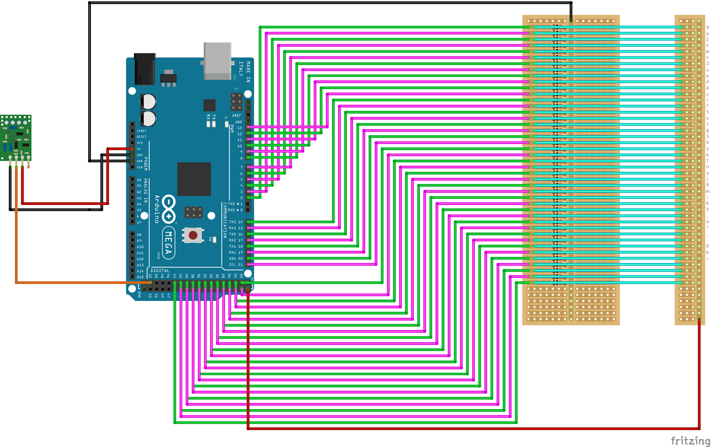

# Paso a paso para maquinita-pantalla de leds 

Se necesita:
- Arduino MEGA 2650
- Arduino UNO
- El código que vamos a dejar acá para cada Arduino
- Máquina de escribir
- Dos baquelitas
- Resistencias de 10K
- Cable, mucho cable.
- Componentes de Arduino de señal de radio (emisor y receptor, aquí usamos los JMR-Tx y JMR Rx 433)
- Pantalla-Matriz LED

---

Con nuestra biscabuela 👵🏼, conseguimos nuestra máquina linda preciosa :

---
Ya con la máquina de escribir de la biscabuela 👵🏼, hay que producir una baquelita que se ubica debajo de la máquina y hace que al oprimir cualquier tecla, se complete el circuito hacia uno de los pines.

---
A esa baquelita le soldaremos unos cables que salgan a comunicarse con los pines del Arduino.

---
Con ayuda de 🩵 **Nila** 🩵, se pone la baquelita debajo de la máquina.

---
Este va a ser el mapa de nuestros pines en el código y en el arduino para que la máquina escriba cada tecla.

---
Conectada a nuesta baquelita deberemos hacer los circuitos para que no se cocinen los pines una vez le mandemos los 5V cuando se complete el circuito.

Usando resistencias de 10K **(café-negro-naranja-dorado) **

Este es el circuito:

----

Una vez terminemos de conectar los pines del Arduino a la segunda baquelita debe verse así de hermoso:

---
Cuando ya la exhibes al mundo y chicaneas:

